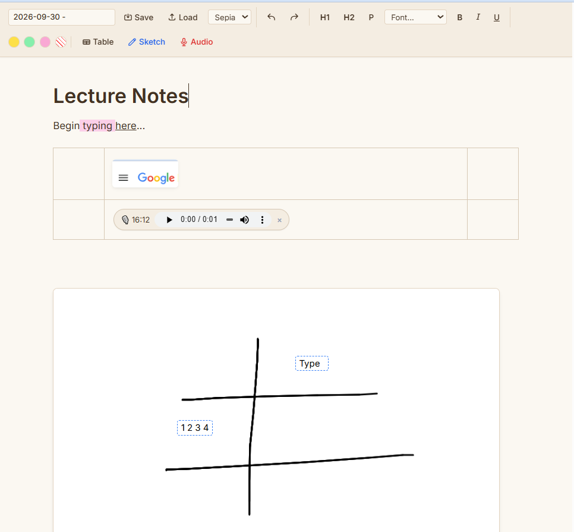

# LectoSketch 📝🎙️

> A lightweight, zero-dependency in-browser multimedia notebook designed for fast lecture notes, sketches, tables, and voice memos.



## ✨ Key Features

- **Rich Text Formatting**: Headings (H1/H2), fonts (*Inter*, *Merriweather*, *JetBrains Mono*), and text highlighter colors.
- **Embedded Voice Notes**: Record quick voice memos directly into the note right at your cursor position.
- **Smart Sketchpad**: Built-in canvas modal for freehand diagrams, handwritten notes, and annotations with double-click floating text.
- **Interactive Images**: Drag & drop images into the document or between table cells, with smooth corner resize handles.
- **Dynamic Tables**: Interactive visual grid picker to quickly insert structured tables.
- **Theme Switcher**: Instant switching between Light, Dark, and warm Sepia modes.
- **Local JSON Export**: Save and load files directly on your machine (`.omni` format) without external databases or server storage.

## 🚀 Live Demo

Try it directly in your browser:
👉 **[Open Live Demo](https://quakebass-bit.github.io/LectoSketch/)** *(replace with your GitHub Pages URL)*

## 📦 Getting Started

LectoSketch runs entirely in the browser without Node.js, bundlers, or build steps:

1. Clone the repository:
   ```bash
   git clone https://github.com/quakebass-bit/LectoSketch.git
   ```
2. Open `index.html` in any modern web browser (Chrome, Firefox, Edge, Safari).

## 🛠 Tech Stack

- **Core**: Vanilla HTML5, Modern JavaScript (ES6+), CSS3
- **Styling**: [Tailwind CSS CDN](https://tailwindcss.com/)
- **APIs**: MediaStream Recording API (`getUserMedia`), HTML5 Canvas API, Drag and Drop API

## 📄 License

This project is licensed under the MIT License — see the [LICENSE](LICENSE) file for details.
